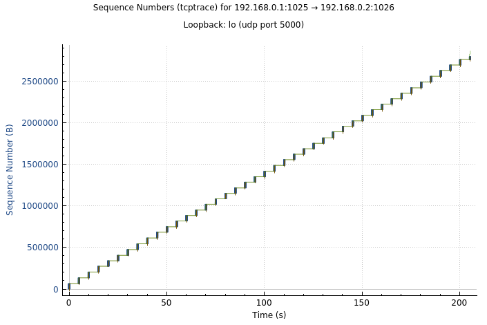

# TCP 

## API Design Choices
### What happens when a packet is received 
From the IP layer, when each TCP packet is received, the TCP handler will be called accordingly, reaching the 
`ReceivePacket` routine found in `tcp_handler.go`. From there, after computing the checksum, using the fields found in both the IP header and the TCP header, an instance of a SocketData struct is created—this is effectively the tuple into the socket table that the TCP handler keeps track of for this particular node. And with this SocketData struct, we find the corresponding TCB entry from the socket table (and if the entry doesn't exist the packet is dropped). Then, we switch on the state that the socket is currently in and call the appropriate handler routine for each of the corresponding states. And within each state function, additional checks are done on the header flags and each packet is handled accordingly to the state machine diagram. 

The TCB doesn't actually store the conn object that are returned from API calls such as VConnect and VAccept. Instead we treated VTCPConn and VTCPListeners as abstractions in that in each API call, it would effectively be a wrapper around the corresponding TCP handler -- each of these "conns" would store a pointer to the TCP handler and in each API function, it would invoke the handler's corresponding function. For instance, in the case of `VRead` and `Vwrite`, it would call `TCPHandler.Read` and `TCPHandler.Write`. We designed it this way as the TCP handler was effectively functioning as the network stack found in the kernel and we needed a way to 'transfer control' to the kernel, so to speak. Each of these conn objects would store their SocketData structure, so that when the TCP handler functions called, they would be able to use the conn objects passed in to find the corresponding TCB entry. 

The two API calls that are not explicitly related to the API of a connection are invoked by the node instead using the TCP handler. 

## Concurrency 
Each access to the TCB Entry is protected via a mutex and most of the condition variables used are also protected by the same mutex. 

There are places that we could maybe be a bit more fine grained about the locking, but there are places that we tried to optmize. 

### VTCPConn
**Read**
- `readAll` flag would indicate whether or not ALL the amount of bytes specified would need to ALL be read. 
- The assumptions made in this call was that the user had already preallocated the correct amount of space to adequately read all the data for the data array that was passed in

Because there is a possibility that the socket could have reading shutdown, we added a check to see if reading has been cancelled (using an atomic boolean variable), we also have a similar check to see if we are reading on a socket that has already terminated due to a retransmission timeout. In the event that the socket is in CLOSE_WAIT and there is no data to be read, we return immediately. If CLOSE_WAIT is specified, but there is still data to be read, then we will still read as there could still be data that hasn't been read yet (even though it might be ACK'ed already). 

At the beginning of each loop, we check to see if there's still data to be read using the appropriate pointers -- i.e. if `LBR != RCV.NXT` and if there isn't data to be read but `readAll` flag was false and there was some data that we read, then we should return. Otherwise, we block using a condition variable that the Receiver will notify until either data becomes available to read or the socket has terminated (and there is no data left to read) -- either because we are in CLOSE_WAIT or a retransmit timeout has occurred. 

And once data becomes available, we copy it into the user allocated buffer, taking into account in the event that the receive buffer wraps around. 

**Write**
In the event that the write part of the connection has been closed, at the top of the write routine, we check a boolean flag that indicates whether or not writing is permitted. There might be a case in which the variable is modified in the Write routine, we decided that in that case, the write should still complete, but the next time the write is called, the write will not succeed. 

The write routine could block in the event that there is no space available left in the buffer, to account for this we use a condition variable `WriteBlockedCond`, which will be broadcasted to in the event that `SND.UNA` increments due to old data being acknowledged. Once there is space left in the buffer, the data from the user is then copied into the send buffer. For each iteration of a for loop, we determine how much can be copied at a time: the minimum between how much space is remaining in the buffer and how much hasn't been written yet. At the end of each for loop, a condition variable is signaled in the event that the Sender is waiting for more data to be placed in the SND buffer. 

### VTCPListener
**Accept**
Each listener socket TCB entry has an additional field that keeps track of pending connections, which is for the case in which a connection is made to the listener before `Accept()` is called. Thus the first thing that is checked in `Accept()` is whether there are pending connections, in which case the first connection is popped of the queue and returned. 

If there are no pending connections, then this routine will wait on a condition variable and signaled to when a new connection has been established and added to the queue. (To implement this, we added a new variable in the TCB Entry such that when a new connection is established from connecting to the listener, the resulting TCB entry keeps track of the listener's tuple of data and is able to index into the socket table and signal the listener's condition variable that way). 

**Close**
The listener has a separate close call than a normal connection: 
- It's marked as cancelled 
  - The pending condition variable is signaled and thus in Accept() after the wait, this boolean variable is checked 
- The entry is removed from the socket table 

## Sender
When a connection reached the `ESTABLISHED` state, it spawns a goroutine that is running an infinite for loop that waits until there is data available to be sent or there is more space available in the send window. We implemented this using a number of condition variables: 
- SendBlockedCond --> will be notified in Write() when data is available to be sent 
- ZeroBlockedCond --> the routine will wait here until the window is no longer equal to zero, this will be signaled to in Receive() when the advertised window is no longer equal to 0 
- WriteBlockedCond --> the routine will wait here when an entire window of data has been sent, thus will need to wait until some data has been ACK'ed before sending more. This is broadcasted to in Recieve(). 

For each iteration of this infinite for loop, we have an inner for-loop that keeps executing while there is space left available in the window to send. And for each iteration of this inner for-loop, the amount sent is the minimum between how much is left in the window and how much data there actually is in the buffer (distance between LBW and NXT); the routine is blocked in the case that there is data is available to be sent. 

In the event that the advertised window becomes 0 and there is data left to be sent, a goroutine is created that will do the zero probing with 1 byte of data until the condition variable is signaled to and the goroutine is cancelled. In this case the SND.NXT pointer is incremented by 1 to account for 1 byte of data that was sent. 

## Receiver

Upon arrival of a segment, we split up each different TCP state with each of their own handlers to process the packet differently, depending on what packets that state expects.

In the handshake, when a packet arrives that conforms to the expectations in the RFC (for example when an ACK arrives for a SYN in `SYN-SENT`), we progress to the next state and create TCB data structures when appropriate.

When in `ESTABLISHED`, we utilize a function called `Receive()` in `tcp_handler_core.go` that processes incoming packets. (This function is also used to process packets normally in states such as `FIN WAIT 2`).

This function checks to see if the packet has a payload, if so, it checks to see whether the packet's sequence number is valid, adds the payload to the buffer if so, and increments necessary buffer pointers. 
Then it will send an ACK back to the sender acknowledging what it currently has if the packet's sequence number was invalid, or the updated pointer values if the receiver was able to process data. This process also signals waiting threads blocked on a condition that there needs to be data to be received in the buffer before reading.  

Because the receiver can also send data, we also check the ACK number this packet has. If the ACK number is valid and acknowledges new data, then we increment necessary pointers for the sender side. This also signals blocked threads waiting on more data to be acknowledged in the buffer before sending more, as well as if the window has now been updated from 0 to stop zero-probing.

### Early Arrivals 
We used a min-heap data structure sorted based on the sequence number of the packet as our early arrivals queue. This queue stored the payload length as well which allowed us to find the "boundary" of what segment this packet contained in the buffer.

When a packet received that had a sequence number that was greater than the receiver's NXT pointer but still within the window, we would add it to our early arrivals data structure.

When a packet received has the expected sequence number of equal to our receiver's NXT pointer, we checked to see the early arrivals queue if any packets in the queue could be "merged" with this packet and ACK'd all at once. If so, we would return the highest ACK num that the receiver could send back that acknowledged a continuous segment in the buffer, updating all necessary pointers accordingly.

## Connection Teardown 
When Close() is called on a normal connection, we will try to send a FIN, though in the case that there is more data to be sent, we have a condition variable that blocks until all data has been sent and is notified in the `Write()` routine. 

After sending a FIN, and adjusting the state appropriately, the routine will block on a channel waiting to get the notification that a connection is now in the state `CLOSED` and the TCB entry can be removed from the socket table. The appropriate condition variables are also signaled: namely, `SendBlockedCond` and `WriteBlockedCond`.  

Afterwards, the appropriate state changes are handled in `tcp_segment_receive.go`. 

Once a connection has reached `FIN_WAIT_2` and receives a FIN and goes into `TIME_WAIT`, a goroutine is created to wait `2*MSL` before notifying `Close()` that the TCB entry can be deleted. In the event that another FIN is received in `TIME_WAIT`, the timer is reset and the `2*MSL` wait restarts. 

## Handling Timeout/Retransmissions
To implement timeouts and retransmissions, we used a timer for each TCB entry/socket that would reset once a packet is sent or if an ACK was received that acknowledged new data that was sent. 

If the timer were to timeout, we would send the most recently unacknowledged packet in a retransmission queue, which contained the payload length and the packet's header. We chose to store these values as we could use the header data to reconstruct the packet, and find the payload data by re-indexing into the buffer using the payload length and the packets sequence number in the header. We also have the guarantee that the retransmission queue is always ordered based on sequence number due to the sender always sending sequentially (and the data is also guaranteed to be in the buffer).
When an ACK would be received, we would need to update the retransmission queue by removing all packets that the incoming ACK num had acknowledged.

To calculate the dynamically updating timeout values, we used the RTO (retransmission timout) formula given in lecture that utilized the previous SRTT (smoothed round-trip time) and the current calculated RTT (round-trip time) in order to calculate the new SRTT.
We did this by storing a map from a packet's expected ACK number (the sequence number + length of payload) to a timestamp, and when the ACK would be received for that packet, we took the difference in timestamps and found the RTT, which would be used to find the RTO. On the first packet, we special cased the SRTT to just be the RTT.

## Congestion Control 
Congestion Control 
For congestion control, I implemented TCP Tahoe, which includes slow start, congestion avoidance, and fast retransmit. I added some additional fields to the TCB, which included the `cwnd` and the `ssthresh`, which are the congestion window and the slow start threshold respectively. I also added an additional field that specified whether or not congestion control is enabled using an atomic boolean value. 

Then, in the `Send()` function, I modified the window that was being used so that it would take the minimum between the advertised window and the `cwnd`. (For sockets that don’t have congestion control enabled, `cwnd` is initialized to be `MAX_BUF_SIZE`). 

And in the `Receive()` function, when we receive a new ACK number, in the case that congestion control is enabled, the `cwnd` would be updated — and it would be updated to a different value depending on whether the `cwnd` was less than `ssthresh` or greater than. If it was less than, slow start would be used and the `cwnd` would be incremented by MSS (which is 1360 bytes). In the case that `cwnd >= ssthresh`, then the `cwnd` would be updated by `(MSS * MSS) / cwnd`. 

To implement fast retransmit, I added another field in the TCB that would keep track of the most recently seen ACK, and also a counter to keep track of the number of times seen. When the counter reached 3 duplicate ACKs, the frequency would be updated down to 0 and the packet would be retransmitted. 

--- 

## Measuring Performance

For a 2MB sendfile on a lossless network, our implementation took around 215 seconds. File contents are the same.

Throughput graph of a 1MB sendfile through with a 2% lossy node in between:

## Packet Capture

(see `packet_capture/1mb_over_lossy_middle.pcapng` for the packet capture)

For a 1MB sendfile through with a 2% lossy node in between:

### Handshake

Packets 27, 28, 29.

Connection `192.168.0.4` is initiating the connection. It sends a SYN (packet 27), which is ACK'd by the receiver, who sends its own SYN (packet 28) which is then ACK'd by the sender (packet 29).

### One example segment sent and acknowledged

Packets 56, 62.

56: `192.168.0.4` sends a packet with sequence number 16385 and payload length 1360, expecting an ACK number of 16385+1360= 17745

57-61: (`192.168.0.4` continues to send through its buffer) 

62: `192.168.0.1` responds with an ACK acknowledging (all data up until) this packet.

### One segment that is retransmitted

Packets 185 (not shown in screenshot), 235, 236.

185: `192.168.0.4` sends a packet with sequence number 103617.

233,234: `192.168.0.1` still has not received a packet with sequence number 103617 although `192.168.0.4` has sent beyond this sequence number. `192.168.0.1` responds that it is still expecting 103617

235: `192.168.0.4` times out and retransmits packet with sequence number 103617.

236: `192.168.0.1` is able to acknowledge this packet, along with the other packets it has queued up in early arrivals, responding with sequence number 131072

### Connection Teardown

Packets: 2270, 2274, 2275, 2276

2270: `192.168.0.4` is done sending, so it sends a FIN

2271-2273: `192.168.0.1` is not done acknowledging data, so it queues the FIN and responds with its current ACK number, while acknowledging more data

2274: `192.168.0.1` acknowledges the FIN sent by `192.168.0.4`

2275: `192.168.0.1` now can send its own FIN to terminate the connection

2276: `192.168.0.4` acknowledges the FIN sent by `192.168.0.4`

--- 

# IP

## Abstraction between link layer and its interfaces
- We created a struct that represents the link interface, which contains information about the UDP port and address, the interface number, the interface's ip address, and whether the interface is up/down 
- Created a host struct that represents the IP layer, which is responsible for determining where to forward ip packets and interfacing with the different handlers that may receive those packets of data 
- Each handler had its own struct that implemented a handler interface struct, on startup, the host will register the individual handlers 

## Threads and RIP protocol 

### Threads
These goroutines are called in `StartHost`:
- Go routine that is listening for packets on the host through the UDP protocol
- Go routine on the host that is listening for to-be-sent messages from the RIP handler, which is then sent through the correct interface

We also have a goroutine when we process a packet for a handler (`ReceivePacket`) (so that it doesn't block the calling thread).
For the same reason above, we run the function to forward a packet to be sent on the correct interface in a goroutine.

In the RIP handler, we have goroutines to handle timeouts. Whenever a new entry is created in the routing table, we create a new goroutine that is constantly waiting on a timer. This goroutine is associated with a channel for that entry that accepts an "update" message to reset the timer.

If the timer reaches the timeout before an update message (from the periodic updates) is received, the entry gets updated with a cost of INFINITY (effectively deleting the entry). 

And if the entry received from the RIP message already exists in the routing table, it is determined if it needs to be updated in the routing table, and if it needs to be updated, then the entry is updated to the routing table and added to a list. After iterating through all of the entries, a goroutine is created that will send all the updated entries to all the neighbors. And for each of these entries, it is checked if they are not in the host's own IP addresses, and if it's not, then an update is sent through the channel. Entries with a different next hop are ignored. 

Separately from all of this is a goroutine that is running asynchronously that will every five seconds, send an update to the neighbors and once a RIP message has been created, it will send that message through a channel to the host. 

## Steps on receiving an IP Packet 
Upon receiving an IP packet from an interface on the host's UDP port, we:
- check the IP version, if it is not IPV4, we drop the packet
- we recompute the checksum and compare it against the previous value 
- decrement TTL
- check the destination:
  - if it is meant for us (it has reached its destination):
    - we handle the packet in the respective application handler with the protocol number
  - otherwise we need to forward the packet:
    - check if the TTL is == 0, if it is then the packet should be dropped
    - if we reached this point, we are good to send consult the routing table for the correct next hop and process the packet on the correct interface

## Known bugs 
We hope none at the moment. There's a bit of weirdness when running with the reference node and one of the node is quit, there's an entry is that might be printed with a cost of 17, which means that an entry with 16 is sent and it's updated when entries of 16 shouldn't be forwarded. 

## Design Decisions 
We chose to have one UDP connection per host, and then reused this connection for all the interfaces when sending to destinations as well as listening for incoming messages. The host would have one goroutine to listen on the interface for incoming messages.

When registering handlers, we have an generic `InitHandler()` function that takes in generic data to set up the respective handler. For RIP, this means that we need to pass in the routing table, the host's interfaces, and the host's neighbors so that the RIP handler would have access to this information.

For communication between the different layers, we added a couple different channels. 
The has a channel to: 
- receive IP packets from the link layer. This is so that the link interface doesn't necessarily need to know about the host that it's connected to -- i.e. having more of hirearchial relationship between the host and its link interfaces. When passing data to send via the link layer, the host will invoke the Send function of the local interface and pass the IP packet to send. 
 
- receive bytes of data from the rip handler to create an IP packet to send to the link layer. This channel will be used when the RIP protocol periodically sends updates every five seconds or for triggered updates. The host will propogate data received to the RIP handler by passing it to the ReceivePacket routine that is part of each protocol handler. 

## Traceroute 
Added two different ICMP messages: 
- Echo --> this is used to ping the hosts with incrementing TTLs until an echo reply is sent back indicating that the route has finished 
- Time exceeded --> this is used to let the thread running traceroute know the next hop in the sequence 
I added an additional handler that will process the different ICMP messages and handle them accordingly. Implemented by adding an additional handler, which would process the ICMP messages and handle them accordingly. 
    - Echo reply --> means that traceroute has found a destination and that information should be propogated to the host thread that is waiting for a response 
    - Echo --> means that we've reached the destination from a source that initiated traceroute and that from this host, a echo reply message shouldn't be sent back to the source 
    - Time limit exceeded message --> the host that initiated the traceroute found the next step in the route and can add that to the paths 

Added the traceroute to the CLI, which can be ran by invoking `traceroute dest` where dest is the IP address of the desired destination. This will invoke a routine in the host, and the host will initiate the protocol by sending echo packets of increasing TTL and after sending each packet will wait for a response. This is assuming that none of the packets will be dropped. Before sending the packets, the destination address is first checked if it's reachable, if it's unreachable, an empty list is returned. 

The handler also has an additional AddChanRoutine and RemoveChanRoutine, which is used such that in the case that a time limit exceeded message is received but it wasn't due to a traceroute command that the routine doesn't hang or block. 

## To run
We developed this project in the container environment. 

To run, you can run `make` or `make clean all` which should create an executable node, which takes in a lnx file as an argument. 

## TODO: 
- code cleanup! in `host.go` 
  - cleanup "link layer reading" abstraction
  - consolidate checksum and sending packet stuff
  - cleanup any error checking/handling 
  - send a rip request without any entries on startup (handle rip request/rip response)
